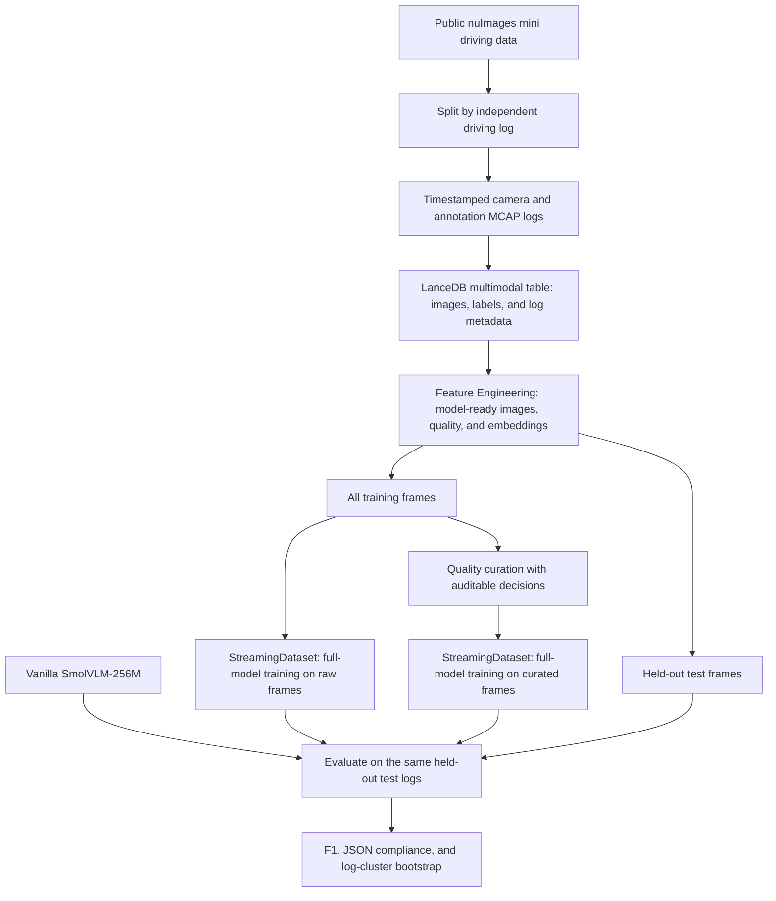
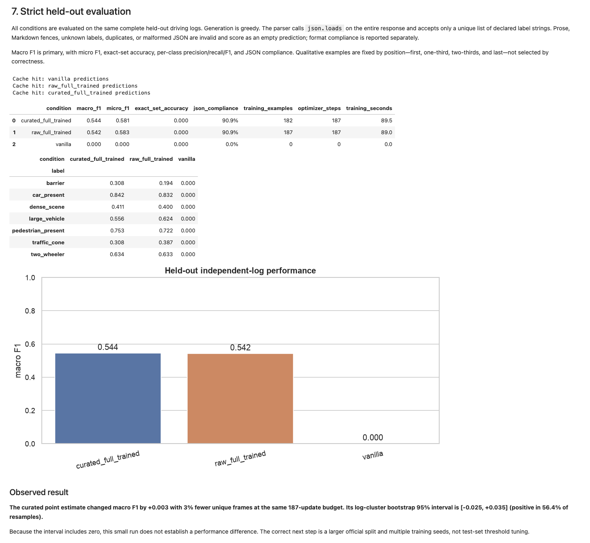

# LanceDB MCAP robotics data curation demo

An end-to-end notebook showing how to turn public nuImages driving data into MCAP logs, ingest them into LanceDB, curate training rows with LanceDB Feature Engineering, and fine-tune a small vision-language model for driving-scene tagging.

The experiment compares the vanilla model with full-model training on all training frames and on a quality-filtered subset. A screenshot of the completed reference run is included below.

## How it works



Both training conditions use the same optimizer-update budget. The reference experiment filters for quality; it computes redundancy features but disables deduplication for this comparison.

## Completed notebook run



[View the full completed notebook results](docs/images/notebook-full-results.png) (long PNG, approximately 6 MB). This capture includes every section, output table, chart, sample image, and run log, with code inputs hidden. Open the image at full size to read the details.

Screenshot of the notebook's rendered evaluation section from the [saved reference run](https://github.com/tsmithv11/lancedb-mcap-demo/blob/8c0eaa07e4457eb49f9cb7f4e83a83a3b3e8dd8e/robotics_data_curation_post_training.ipynb), with code inputs hidden. The curated model changed macro F1 by +0.003 using 3% fewer unique training frames at the same 187-update budget. The 95% log-cluster bootstrap interval is [-0.025, +0.035], so this small run does not establish a performance difference. Results will vary across runs.

## Run it

Python 3.12 is recommended.

```bash
python3.12 -m venv .venv
source .venv/bin/activate
python -m pip install jupyterlab nbformat
jupyter lab robotics_data_curation_post_training.ipynb
```

Run the notebook from top to bottom. It installs any remaining Python packages into the active environment and keeps downloads, generated data, model caches, and results inside the project directory.

The first run downloads roughly 118 MB of nuImages data, a 45 MB feature extractor, and a 0.5 GB vision-language model. Apple Silicon or an NVIDIA GPU is recommended for training. CPU preprocessing works normally; to explicitly enable the slower CPU training path, start Jupyter with `ALLOW_CPU_FULL_TRAINING=1`.

## Files

- `robotics_data_curation_post_training.ipynb` — the runnable experiment.
- `docs/images/notebook-results.png` — evaluation screenshot from the completed reference run.
- `docs/images/notebook-full-results.png` — full-length capture of all sections and outputs from the same run.
- `build_notebook.py` — regenerates the notebook source with `python build_notebook.py`.

This is a compact research demonstration of scene tagging, not a vehicle-control, detection, or sensor-fusion system.
